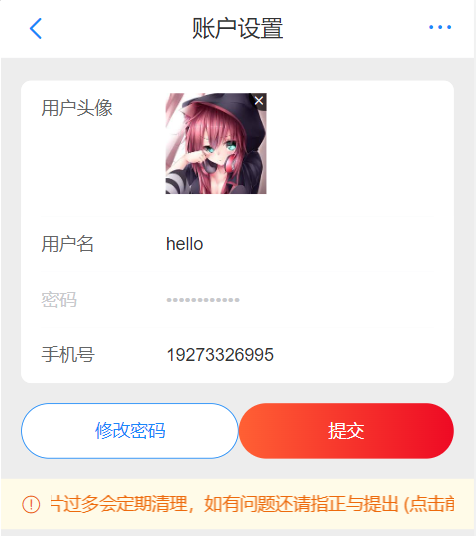

# HBMark

## 项目描述
>+ 一个模仿京东移动端的电商平台网页设计  
>+ 采用前后端分离技术，前端基于vue的独立项目，后端基于express框架
## 主要功能
>+ 包含用户的注册、登录、浏览商品、添加商品、下单，修改信息等功能

## 项目已部署在：[https://hb-jd-practice.netlify.app](https://hb-jd-practice.netlify.app)

## 主要技术 
### 前端  
1. vue3 + Vuex + Vue Router 
2. 移动端组件库vant
### 后端
1. node.js
2. express框架
3. 数据库mysql

## 项目部分界面截图
+ ### 商城首页  
  
+ ### 商品详情
   
+ ### 商品分类
   
+ ### 购物车
   
+ ### 用户页面  
   
+ ### 修改用户信息  
   
+ ### 用户订单
   
+ ### 订单详情
   

